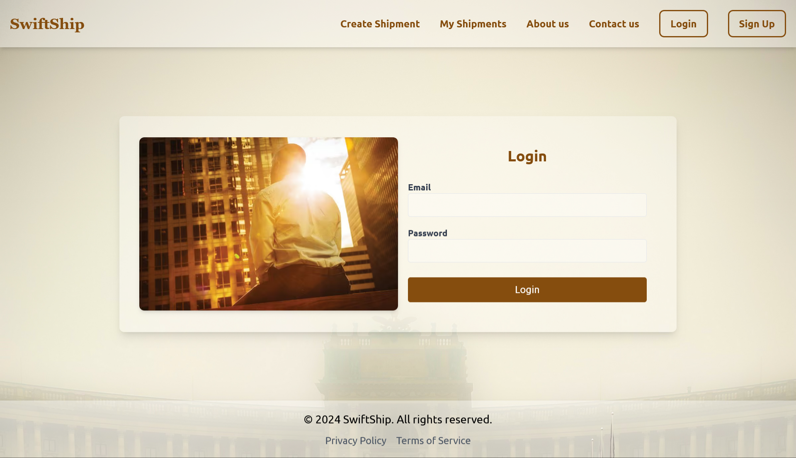
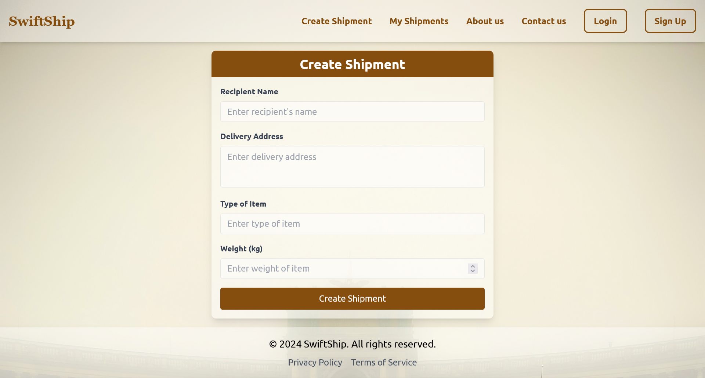
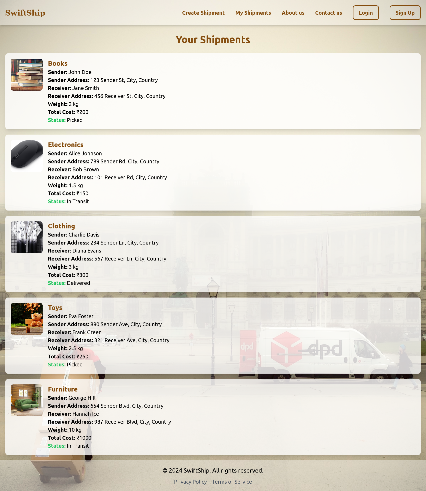
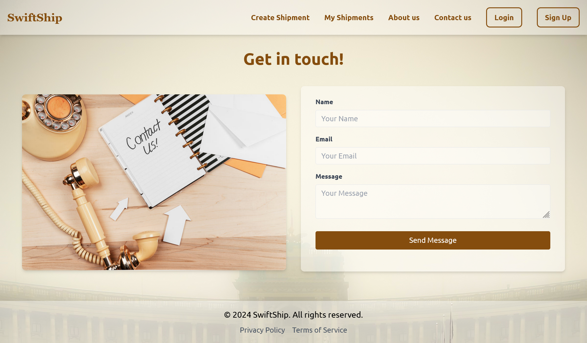
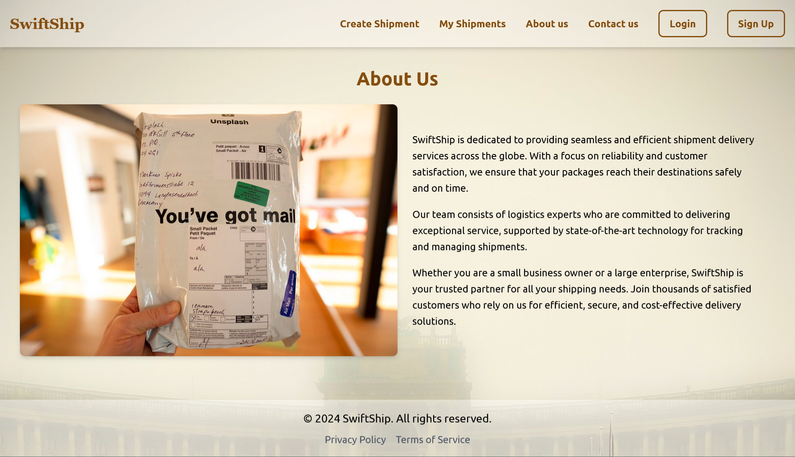

# Shipment Delivery Application

This application is a shipment delivery system built using React, Tailwind CSS, Firebase, and Razorpay. It allows users to create new shipments, track their shipments, and provides admin functionalities to manage users and shipments.

## Features

### For Users

- Create New Shipment: Users can create new shipments by providing details such as sender's name and address, receiver's name and address, item type, weight, and cost.
- Track Shipments: Users can track the status of their shipments (picked, in transit, delivered).

### For Admin

    - View Total Registered Users: Admin can view the total number of registered users.
    - View Total Shipments: Admin can see the total number of shipments created.
    - Manage Shipments: Admin can change the status of shipments (e.g., from picked to in transit, or from in transit to delivered).

## Getting Started

To get started with the project locally, follow these steps:

### Prerequisites

    1. Node.js installed on your local machine.
    2. Firebase account and a Firebase project set up.
    3. Razorpay account and API keys.

### Installation

### 1. Clone the repository

Clone the repository to your local machine using the following command:

```sh
git clone https://github.com/mayankkalra03/swiftship.git
cd swiftship
```

### 2. Install dependencies

Install the necessary dependencies by running:

```sh
npm install
```

### 3. Set up Firebase configuration:

    1. Create a Firebase project and set up Firebase Authentication and Firestore.
    2. Obtain your Firebase configuration (apiKey, authDomain, projectId, etc.) and replace placeholders in your project setup.
    3. Ensure Firebase Authentication is set up with email/password authentication enabled.

### 4. Set up Razorpay integration:

    1. Obtain your Razorpay API keys (key ID and key secret).
    2. Integrate Razorpay payment processing functionality as per your application's requirements.

### 5. Start the application

Launch the application with:

```sh
npm run dev
```

### 6. Visit the application

Open http://localhost:5173 to view the application in your web browser.

## Screenshots

### Homepage


### Login



### Signup


### Create Shipment



### User Dashboard



### Admin Dashboard


### Contact Us



### About Us


